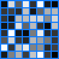
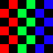

# React Pixel Grid

Declarative pixel grid component based on [freeman-lab/pixel-grid](https://github.com/freeman-lab/pixel-grid).

`npm install react-pixel-grid`


## Usage



```jsx
import PixelGrid from "react-pixel-grid";

<PixelGrid
  data={Array(64).fill(0).map(Math.random)}
  options={{
    size: 10,
    padding: 2,
    background: [0, 0.5, 1],
  }}
/>
```

<br/>



```jsx
const r = "#f00";
const g = "#0f0";
const b = "#00f";
const x = "#000";

<PixelGrid data={[
    x, r, x, g, x, b, 
    r, x, g, x, b, x, 
    x, r, x, g, x, b, 
    r, x, g, x, b, x, 
    x, r, x, g, x, b, 
    r, x, g, x, b, x,
]} />
```
